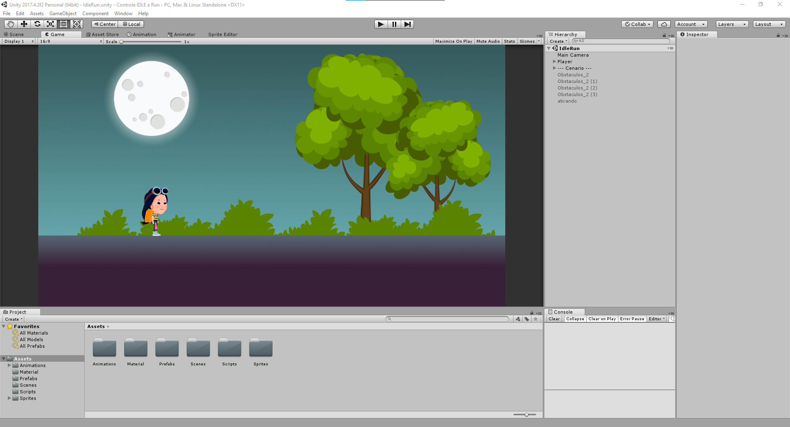

<div align="center">


</div>



# Unity-Animacoes-e-Controller
Projeto de aprendizado de Animaçoes de personagem e Controlar

### 📋 Pré-requisitos
Para quem Só quer ver Rodando:
```
- Ter um PC.
- Ter um Celular Android (Em Breve)
```

Para quem quer ver com mais detalhes[codigo fonte, imagem e etc...]:
``` 
- Ter um PC.
- Ter a Unity 2017 instalada;
- Ter o Visual Studio (qualquer versao) instalado;
```
## Links para download
### 💻 Download Necessários 
- Unity IDLE --> https://unity.com/releases/editor/archive | Unity Hub --> https://unity.com/pt/download
- Visual Studio --> https://visualstudio.microsoft.com/pt-br/downloads/

### 🔧 Execução

Antes de tudo:
```
Faça o download ou clone do repositório - [Rodrigo](https://github.com/Rodrigo-Santoos) ou baixa em .ZIP e coloque
no local de sua escolha.
```


Para iniciar a aplicação e ver Rodando:
```
Depois de Baixar, abra a pasta [Arquivo Exe] e clique 2 vezes em IdleRun.exe, automaticamente o jogo vai iniciar
```
Para adicionar a aplicação na Unity:
```
No Unity Hub adicione a pasta [Controle IDLE e Run] e abra, automaticamente ira abrir o projeto na IDLE.
```

## ✒️ Desenvolvido por

* **Rodrigo Oliveira** - [Rodrigo Oliveira](https://github.com/Rodrigo-Santoos)
